# 📱 Huawei Manager Mobile

<p align="center">
  
</p>

<div align="center">


[](https://github.com/alrescha79-cmd/huawei-manager-mobile)


</div>

<p align="center">
  <strong>Mobile app cross-platform untuk mengontrol dan monitoring modem Huawei LTE</strong>
</p>

<p align="center">
  Mendukung seri B310, B311, B312, E5573, E5577, dan modem Huawei LTE lainnya
</p>

---

> [!WARNING]
> **🇬🇧 EN**  
> Login currently still uses WebView, and changing the WiFi password is not yet functional due to limited information about the encryption method used by the latest Huawei firmware.
>
> **🇮🇩 ID**  
> Saat ini proses login masih menggunakan WebView, dan fitur ganti password WiFi belum berfungsi karena keterbatasan informasi mengenai metode enkripsi yang digunakan oleh firmware Huawei terbaru.


> [!TIP]
>  
> 
> **📥 Download di [Github Releases](https://github.com/alrescha79-cmd/huawei-manager-mobile/releases)** Tersedia 3 versi untuk Android


> **arm64-v8a**: Untuk Android 64-bit (Rekomendasi) → [Link Download](https://github.com/alrescha79-cmd/huawei-manager-mobile/releases/latest/download/huawei-manager-arm64-v8a.apk)
> 
> **armeabi-v7a**: Untuk Android 32-bit (Ukuran lebih kecil) → [Link Download](https://github.com/alrescha79-cmd/huawei-manager-mobile/releases/latest/download/huawei-manager-armeabi-v7a.apk)
>
>**universal**: Untuk semua perangkat (Ukuran lebih besar) → [Link Download](https://github.com/alrescha79-cmd/huawei-manager-mobile/releases/latest/download/huawei-manager-universal.apk)

> **⚡ Built with Expo SDK 54**

> **📡 Tested on Huawei B312-929 (Orbit Star 2) and Android 15 (Iqoo Z7)**

> [!NOTE]
> **⚠️ Known Issue / Masalah yang Diketahui** 
> 
> **🇬🇧 EN** — SMS feature may not work properly on some devices due to limited modem SMS support.
> 
> **🇮🇩 ID** — Fitur SMS mungkin belum berfungsi sepenuhnya pada beberapa perangkat karena keterbatasan modem yang mendukung SMS.

---

## 📸 App Preview

<details>
<summary><strong>🌑 Dark Mode (Bahasa Indonesia)</strong></summary>

#### 🏠 Home
<p align="center">
  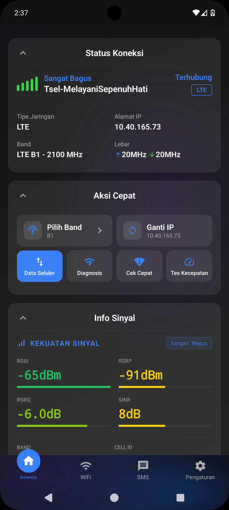
  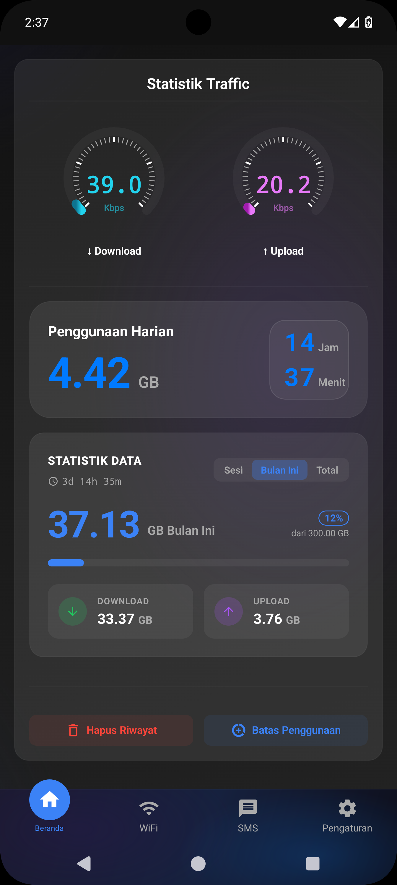
  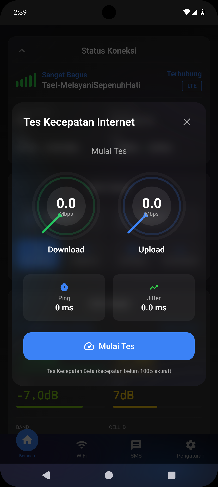
  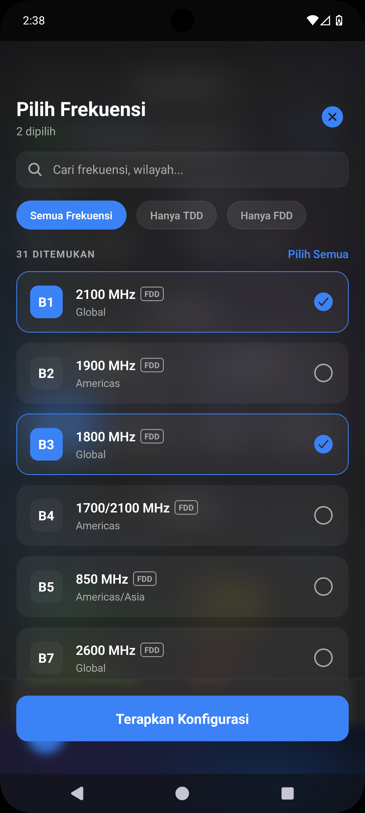
</p>

#### 📶 WiFi
<p align="center">
  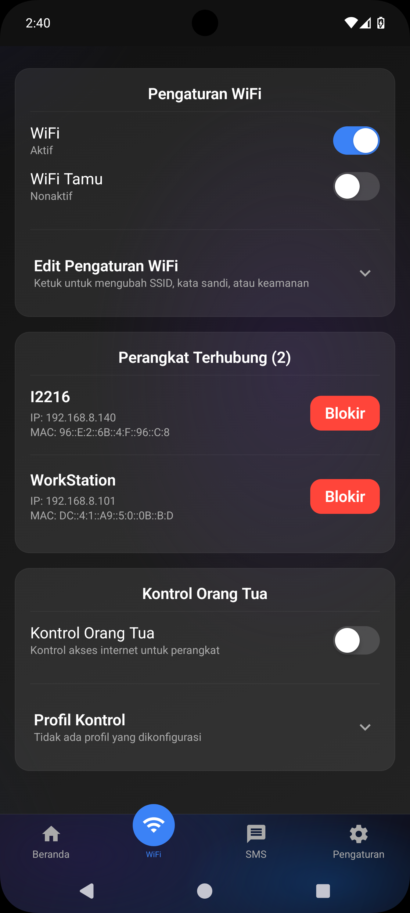
  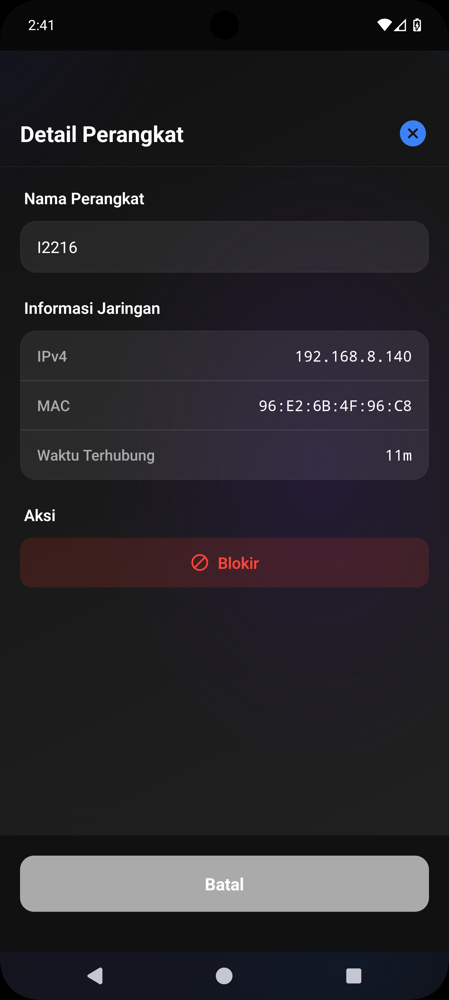
  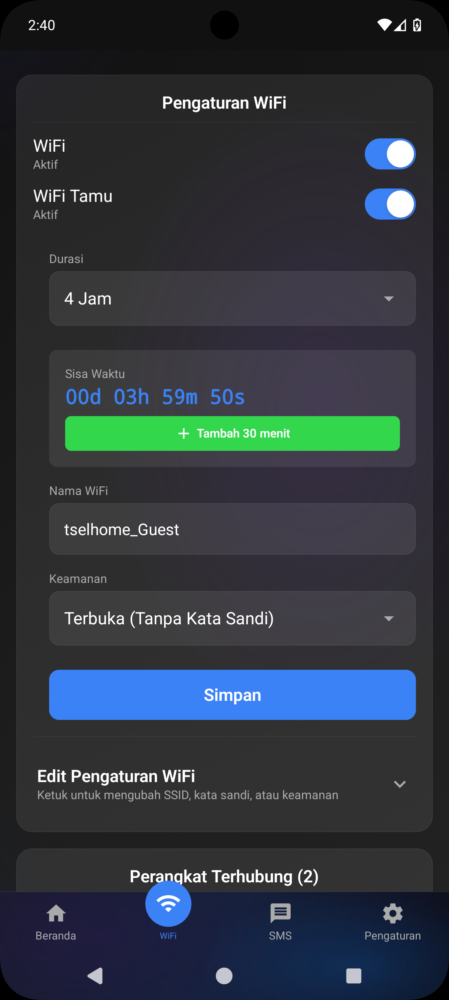
  
</p>

#### 💬 SMS
<p align="center">
  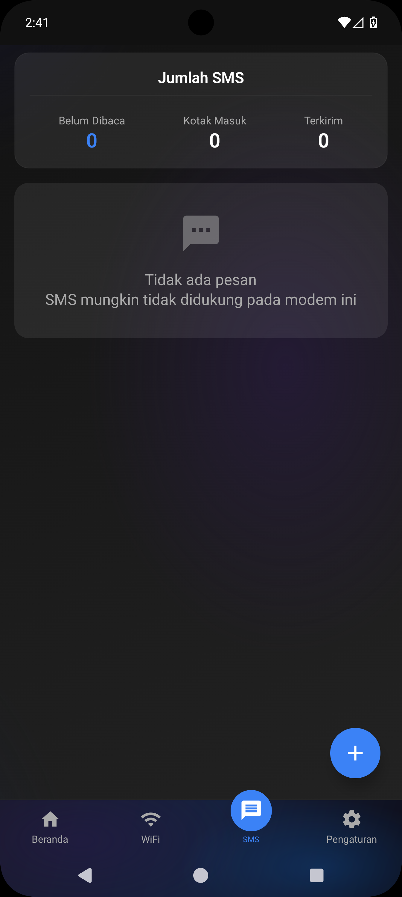
  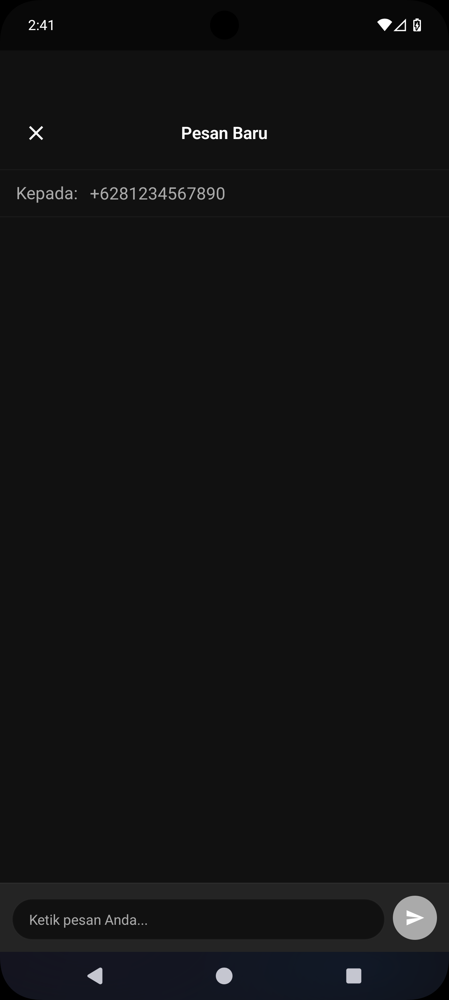
  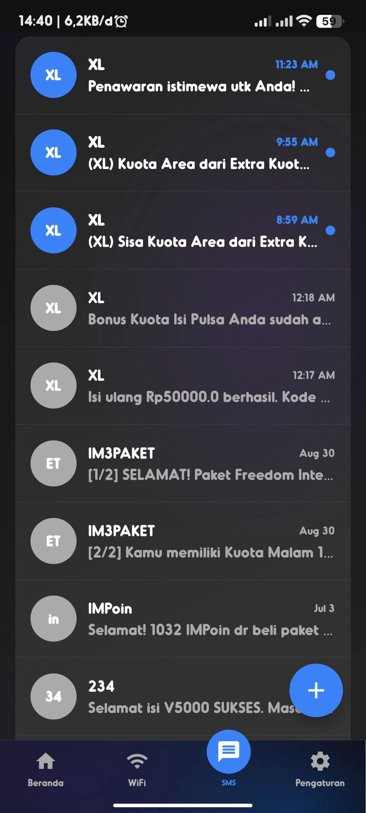
</p>

#### ⚙️ Settings
<p align="center">
  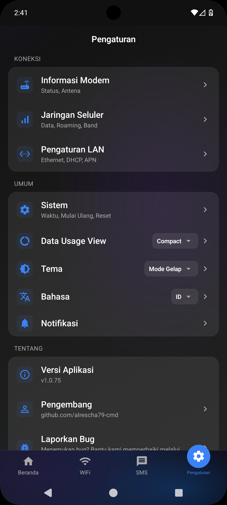
  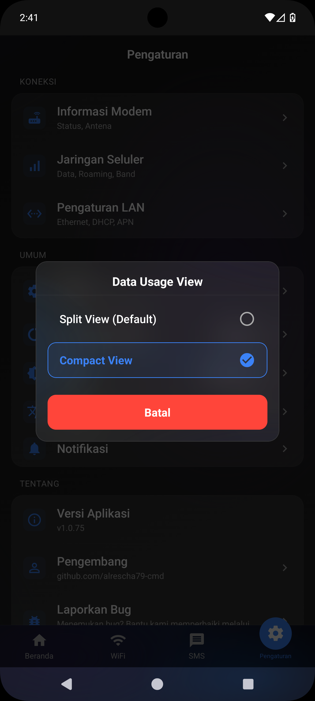
</p>

</details>

<details>
<summary><strong>☀️ Light Mode (English)</strong></summary>

#### 🏠 Home
<p align="center">
  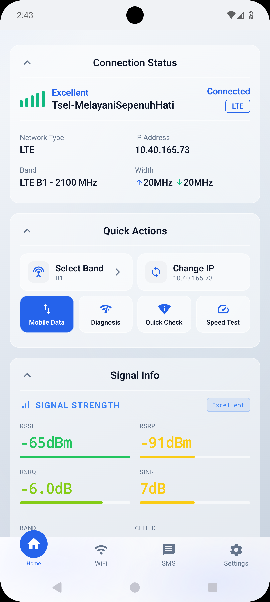
  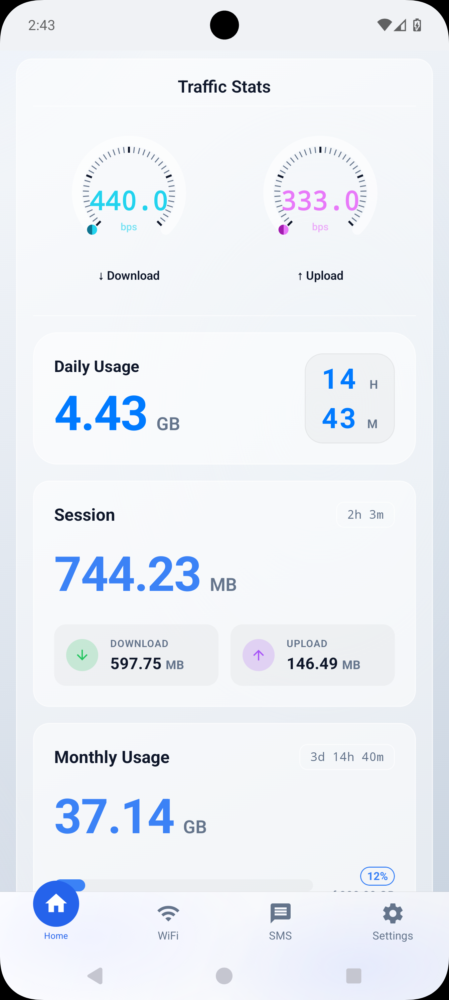
  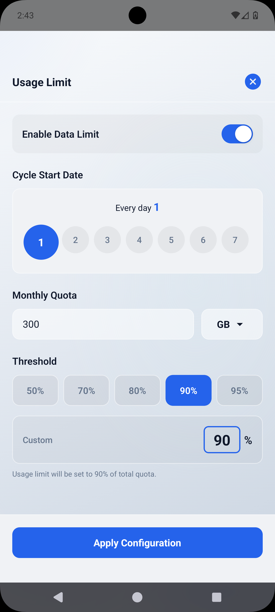
</p>

#### 📶 WiFi
<p align="center">
  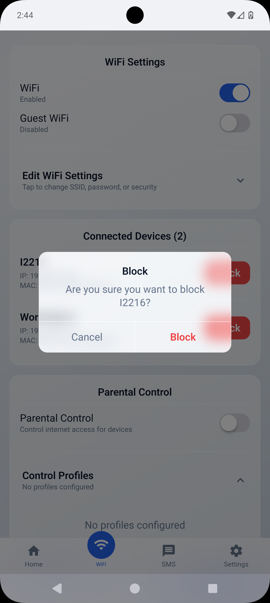
</p>

#### 💬 SMS
<p align="center">
  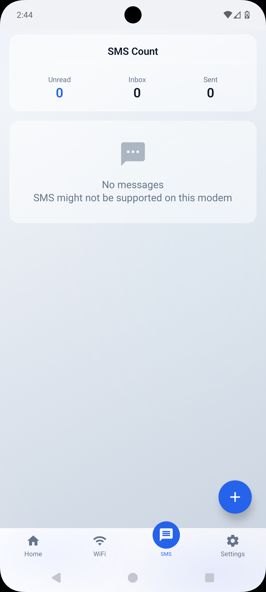
</p>

#### ⚙️ Settings
<p align="center">
  
  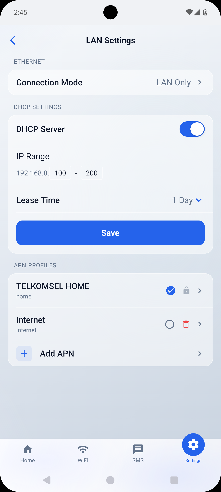
  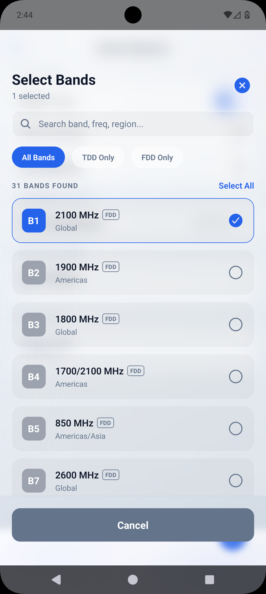
  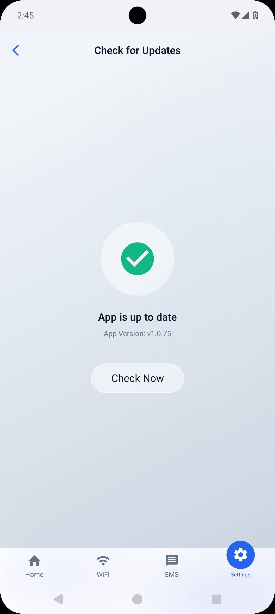
  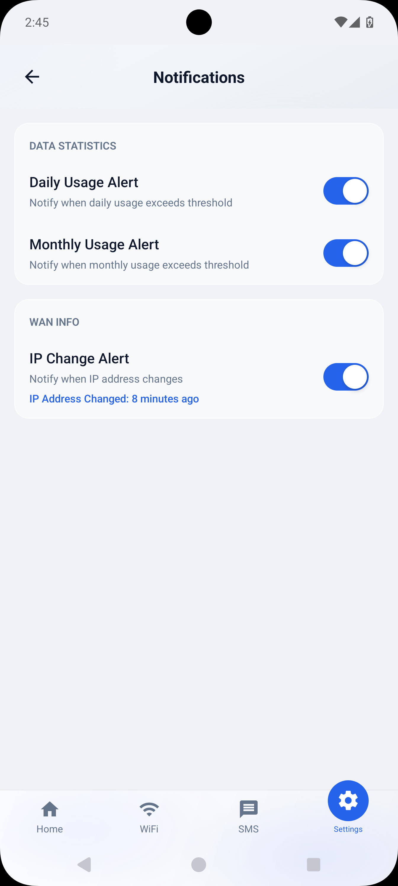
</p>

</details>

---

## ✨ Fitur Utama

| Feature | Description |
|---------|-------------|
| 📊 **Dashboard** | Realtime monitoring signal, traffic, dan status koneksi |
| 📶 **WiFi Management** | Kelola connected devices dan WiFi settings |
| 💬 **SMS** | Baca, kirim, dan hapus SMS (Jika fitur ini tersedia di modem) |
| ⚙️ **Settings** | Antenna mode, network type, band lock, reboot modem |
| 👨‍👩‍👧‍👦 **Parental Control** | Batasi penggunaan perangkat |
| 📱 **Profile APN** | Kelola APN settings |
| 🖧 **Ethernet** | Kelola Ethernet settings |
| 📟 **Widget** | Widget untuk monitoring signal, traffic, dan status koneksi |
| 🌙 **Dark Mode** | Support light dan dark theme |
| 🔤 **Language** | Pilih bahasa (Bahasa Indonesia dan Bahasa Inggris) |
| 📱 **More Features** | Masih banyak fitur yang akan ditambahkan |

---

## 🚀 Quick Start

### Prerequisites
- Node.js v18+
- Expo CLI
- Android device dengan Expo Go

### Installation
```bash
# Clone repository
git clone https://github.com/alrescha79-cmd/huawei-manager-mobile.git
cd huawei-manager-mobile

# Install dependencies
npm install

# Start development
npm run dev
```

### Build APK Using EAS Build
```bash
eas build --profile preview --platform android
```

---

## 📖 Documentation

| Document | Description |
|----------|-------------|
| [Development Guide](docs/DEVELOPMENT.md) | Setup development environment |
| [Architecture](docs/ARCHITECTURE.md) | Tech stack & project structure |
| [User Guide](docs/USER_GUIDE.md) | Cara penggunaan aplikasi |
| [API Reference](docs/API_REFERENCE.md) | Huawei modem API endpoints |
| [Debugging Guide](docs/DEBUGGING.md) | Cara mengirim laporan bug dengan log |
| [Push Notifications](docs/push-notifications.md) | Setup push notifications |
| [Devtools](devtools/README.md) | Reverse engineering Web UI |

---

## 🤝 Contributing

Contributions welcome! Silakan buat issue atau pull request.

---

## 🐛 Bug Report

Menemukan bug? Bantu kami memperbaikinya!

- 📖 **[Panduan Debugging](docs/DEBUGGING.md)** - Cara mengirim log API dari browser
- 🔧 In-app: Settings > Debug Mode > Send Debug Report

[](https://github.com/alrescha79-cmd/huawei-manager-mobile/issues/new?assignees=alrescha79-cmd&labels=bug&projects=&template=bug_report.md&title=%5BBUG%5D+)


---

## 📄 License

MIT License - see [LICENSE](LICENSE)

---

## 📈 Download History

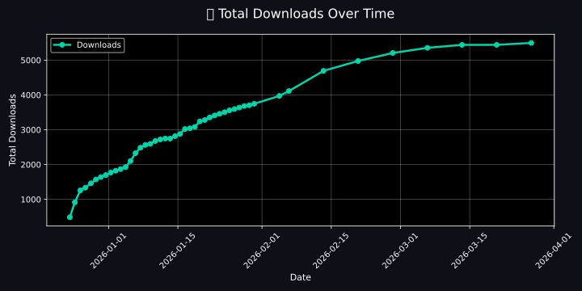

---

<p align="center">
  Made with ❤️ by <a href="https://github.com/alrescha79-cmd">Anggun Caksono</a>
</p>

<p align="center">
  <em>Aplikasi ini adalah proyek independent dan tidak berafiliasi dengan Huawei Technologies.</em>
</p>
