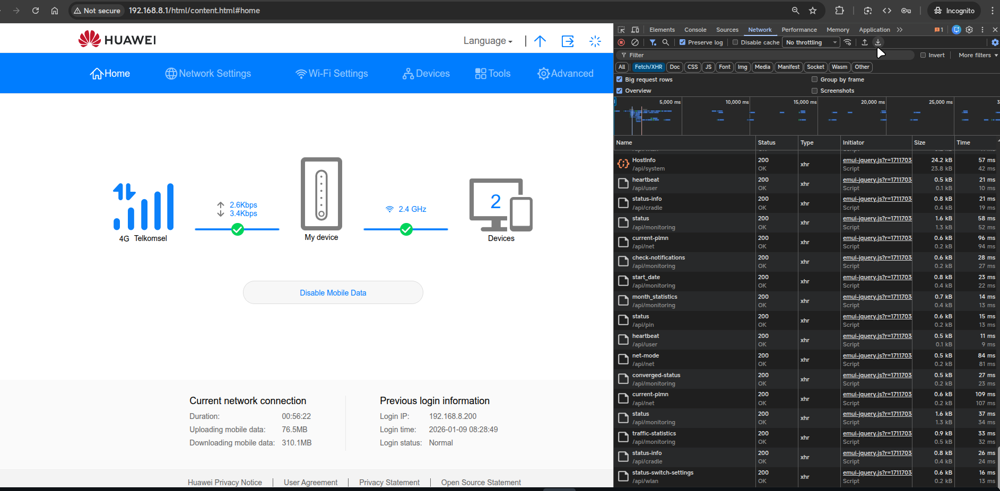

# 🔧 Debugging Guide / Panduan Debugging

Guide untuk mengirim laporan bug dengan log API dari browser DevTools.
---

## 📋 Daftar Isi

- [In-App Debug Mode](#-in-app-debug-mode)
- [Browser DevTools (HAR Export)](#-browser-devtools-har-export)
- [Cara Export HAR dari Chrome](#-cara-export-har-dari-chrome)
- [Cara Export HAR dari Firefox](#-cara-export-har-dari-firefox)
- [Mengirim Laporan Bug](#-mengirim-laporan-bug)

---

## 📱 In-App Debug Mode

Jika Anda bisa login ke aplikasi, gunakan Debug Mode bawaan:

1. Buka **Settings** > **Debug Mode**
2. Aktifkan toggle **Enable Debug Mode**
3. Gunakan aplikasi seperti biasa
4. Kembali ke Settings dan tap **Send Debug Report**
5. Pilih via Email atau GitHub Issue

---

## 🌐 Browser DevTools (HAR Export)

Jika Anda **tidak bisa login** ke aplikasi, Anda bisa capture log API langsung dari browser dengan mengakses web interface modem.

### Apa itu HAR?

HAR (HTTP Archive) adalah format file yang menyimpan semua request/response HTTP. File ini sangat berguna untuk debugging karena berisi:
- Semua API calls
- Request headers dan body
- Response headers dan body
- Timing information
- Error messages

---

## 🔵 Cara Export HAR dari Chrome

### Desktop (PC/Laptop)

1. **Buka Chrome** dan akses web modem Anda (biasanya `http://192.168.8.1`)

2. **Buka Developer Tools**
   - Tekan `F12` atau `Ctrl+Shift+I` (Windows/Linux)
   - Tekan `Cmd+Option+I` (Mac)
   - Klik kanan dan pilih `inspect`

3. **Pilih tab "Network"**

4. **Centang "Preserve log"** (agar log tidak hilang saat halaman reload)

5. **Lakukan langkah yang menyebabkan error**
   - Contoh: Login, refresh data, dll

6. **Export HAR file**
   - Klik kanan di area Network log
   - Pilih **"Save all as HAR with content"**
   - Simpan file dengan nama seperti `modem-debug.har`



### Android Chrome

1. **Connect HP ke PC** via USB
2. **Aktifkan USB Debugging** di HP
3. Buka Chrome di PC, ketik `chrome://inspect`
4. Pilih device Anda
5. Klik **"Inspect"** pada tab yang membuka web modem
6. Ikuti langkah Desktop di atas

---

## 🦊 Cara Export HAR dari Firefox

1. **Buka Firefox** dan akses web modem

2. **Buka Developer Tools**
   - Tekan `F12` atau `Ctrl+Shift+I`

3. **Pilih tab "Network"**

4. **Centang "Persist Logs"**

5. **Lakukan langkah yang menyebabkan error**

6. **Export HAR file**
   - Klik ikon gear (⚙️) di Network tab
   - Pilih **"Save All As HAR"**

---

## 📱 Alternatif: Copy sebagai cURL

Jika tidak bisa export HAR, Anda bisa copy request individual:

1. Di Network tab, klik kanan pada request yang error
2. Pilih **"Copy" > "Copy as cURL"**
3. Paste ke dalam laporan bug

---

## 📝 JavaScript Snippet untuk Log API

Anda juga bisa paste script ini di Console browser untuk log semua API calls:

```javascript
// Paste di Console browser (F12 > Console)
// Script ini akan log semua XHR/fetch requests

(function() {
  const logs = [];
  
  // Intercept XMLHttpRequest
  const originalXHR = window.XMLHttpRequest;
  window.XMLHttpRequest = function() {
    const xhr = new originalXHR();
    const originalOpen = xhr.open;
    const originalSend = xhr.send;
    
    xhr.open = function(method, url) {
      xhr._method = method;
      xhr._url = url;
      xhr._startTime = Date.now();
      return originalOpen.apply(this, arguments);
    };
    
    xhr.send = function(body) {
      xhr._requestBody = body;
      
      xhr.addEventListener('load', function() {
        logs.push({
          timestamp: new Date().toISOString(),
          method: xhr._method,
          url: xhr._url,
          status: xhr.status,
          duration: Date.now() - xhr._startTime + 'ms',
          requestBody: xhr._requestBody,
          responseBody: xhr.responseText.substring(0, 2000) // Limit size
        });
      });
      
      return originalSend.apply(this, arguments);
    };
    
    return xhr;
  };
  
  // Function to download logs
  window.downloadAPILogs = function() {
    const deviceInfo = {
      userAgent: navigator.userAgent,
      timestamp: new Date().toISOString(),
      url: window.location.href
    };
    
    const report = {
      device: deviceInfo,
      logs: logs
    };
    
    const blob = new Blob([JSON.stringify(report, null, 2)], {type: 'application/json'});
    const url = URL.createObjectURL(blob);
    const a = document.createElement('a');
    a.href = url;
    a.download = 'modem-api-logs-' + new Date().toISOString().split('T')[0] + '.json';
    a.click();
  };
  
  console.log('✅ API Logger aktif!');
  console.log('📥 Ketik downloadAPILogs() untuk download log');
})();
```

### Cara Penggunaan:

1. Buka web modem di browser
2. Buka Console (`F12` > Console)
3. Paste script di atas dan tekan Enter
4. Lakukan langkah yang menyebabkan error
5. Ketik `downloadAPILogs()` dan tekan Enter
6. File JSON akan terdownload

---

## 📤 Mengirim Laporan Bug

### Via GitHub Issue (Recommended)

1. Buka: https://github.com/alrescha79-cmd/huawei-manager-mobile/issues/new
2. Judul: `[Bug] <deskripsi singkat masalah>`
3. Isi template:

```markdown
## Device Info
- HP: [contoh: Samsung Galaxy A52]
- Android: [contoh: Android 13]
- Modem: [contoh: Huawei B312-929]
- Firmware: [contoh: 22.328.01.00.00]
- App Version: [contoh: 1.2.0]

## Deskripsi Masalah
[Jelaskan apa yang terjadi]

## Langkah Reproduksi
1. Buka aplikasi
2. ...
3. ...

## Expected vs Actual
- Expected: [yang seharusnya terjadi]
- Actual: [yang terjadi]

## Log File
[Attach file HAR/JSON di sini]
```

### Via Email

Kirim ke: anggun@cakson.my.id
Subject: `[Huawei Manager] Bug Report - <model modem>`

---

## 🔐 Catatan Keamanan

> ⚠️ **PENTING**: 
> - Gunakan incognito mode browser saat debugging agar tidak ada data pribadi yang terkirim
> - Jangan buka tab lain selama debugging (hanya web ui modem)

---

## ❓ FAQ

**Q: Apakah debug mode memperlambat aplikasi?**
A: Sedikit, karena semua API call dicatat. Matikan setelah selesai debugging.

**Q: Berapa lama log disimpan?**
A: Maksimal 500 log entries. Log lama otomatis terhapus.

**Q: Device saya tidak mendukung USB Debugging?**
A: Gunakan export HAR dari browser desktop saat mengakses web modem.
